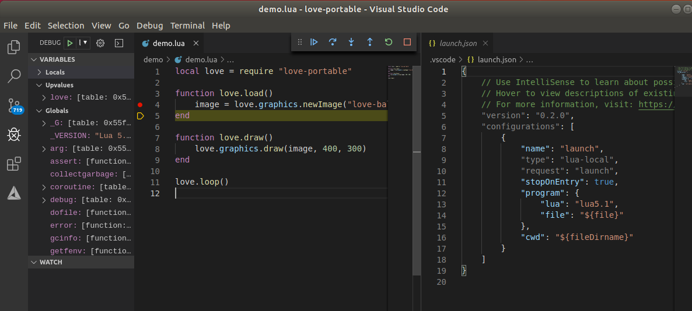

# love-portable

This projects sets up Love2D library (https://love2d.org/) to be used as a module from standalone Lua binary.

## Building

### Install libraries and tools

#### Ubuntu

```
apt update
apt install cmake \
	make \
	g++ \
	libglu1-mesa-dev \
	libfreetype6-dev \
	libmodplug-dev \
	libopenal-dev \
	libsdl2-dev \
	libtheora-dev \
	libvorbis-dev \
	libmpg123-dev \
	libluajit-5.1-dev \
	luarocks
```

#### Alpine

```
apk add --no-cache \
	cmake \
	make \
	g++ \
	mesa-dev \
	freetype-dev \
	libmodplug-dev \
	openal-soft-dev \
	sdl2-dev \
	libtheora-dev \
	libvorbis-dev \
	mpg123-dev \
	directfb-dev \
	luajit-dev
```
Note: luarocks need to be installed from source.
Follow the [installation-instructions-for-unix](https://github.com/luarocks/luarocks/wiki/installation-instructions-for-unix)


### Set no sudo environment

```
eval $(luarocks path --bin)
export LD_LIBRARY_PATH=$HOME/.luarocks/lib/lua/5.1
luarocks make --local
```
### Build with luarocks

```
luarocks make --local
```

## Test

```
lua demo/demo.lua
```

## Debug

Using Visual Studio Code and [Local Lua Debugger](https://marketplace.visualstudio.com/items?itemName=tomblind.local-lua-debugger-vscode) extension.



## Playing Demo instructions
Mouse left - select
Mouse right - selected units with move order to clicked location
Ctrl + mouse right - selected units with attack order to clicked location
Shift + mouse right - toggle patrol point at clicked location
Mouse wheel - zoom
Del - delete selected units
F - toggle fog
D - debug mode
Arrows   - scroll map
Home/KP7 - Cycle cities
A - build archer if player's city is selected
P - build pikeman if player's city is selected
S - build swordsman if player's city is selected
H - build horseman if camp of horsemen is selected
W - build wizard if camp of wizards is selected
